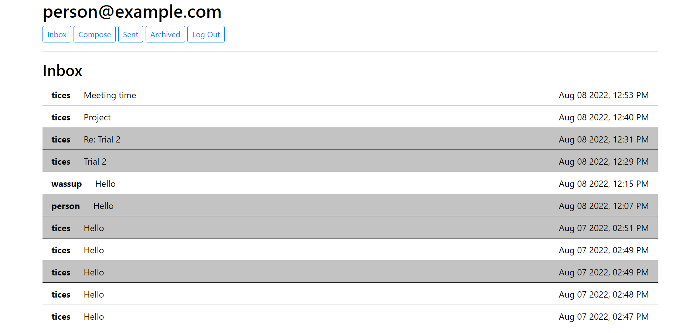

<!-- Please update value in the {}  -->

<h1 align="center">Email Server</h1>

<!-- TABLE OF CONTENTS -->

## Table of Contents

-   [Overview](#overview)
    -   [Built With](#built-with)
-   [How to use](#how-to-use)
-   [Contact](#contact)

<!-- OVERVIEW -->

## Overview



### Built With

<!-- This section should list any major frameworks that you built your project using. Here are a few examples.-->

-   [Django](https://www.djangoproject.com/)
-   [SCSS](https://sass-lang.com/)
-   [Bootstrap](https://getbootstrap.com/)

## How To Use

<!-- Example: -->

To clone and run this application, you'll need [Git](https://git-scm.com), [Node.js](https://www.python.org/) and [Django](https://www.djangoproject.com/) installed on your computer. From your command line:

```bash
# Clone this repository
$ git clone https://github.com/tochidavids/Email-Server

# Run the website
$ python manage.py runserver
```

The first thing you will be shown is either a **login** page or your **inbox** depending on whether you are signed in or not. To **log in**, simply enter your email associated with the account and your password. If you do not already have an account, just click on the `Register here` link to **register**. 

*You can use the emails `example1@email.com` and `example2@email.com` (passsword is `password` for both) for a quick demo.*

Once you are logged in, you will be shown your **inbox** as mentioned earlier. Here, you can see all of the emails that have been sent to you by other users. The name of the sender, the subject of the email and the date and time the email was sent at are shown on each email. 

Click on an email to view its contents. From here, you can **reply** by clicking on the `Reply` button or **archive** the email by clicking on the `Archive` button (this changes to an `Unarchive` button if the email is already archived).

Use the navigation at the top to **switch between tabs**: click on the `Compose` tab to **send an email**, the `Sent` tab to view sent emails and the `Archived` tab to view archived emails. 

To **log out**, simply click on the `Log out` button. 

## Contact

-   [Portfolio Website](https://tochidavids.netlify.app)
-   GitHub - [@tochidavids](https://github.com/tochidavids)
-   Email - tochidavids18@gmail.com
